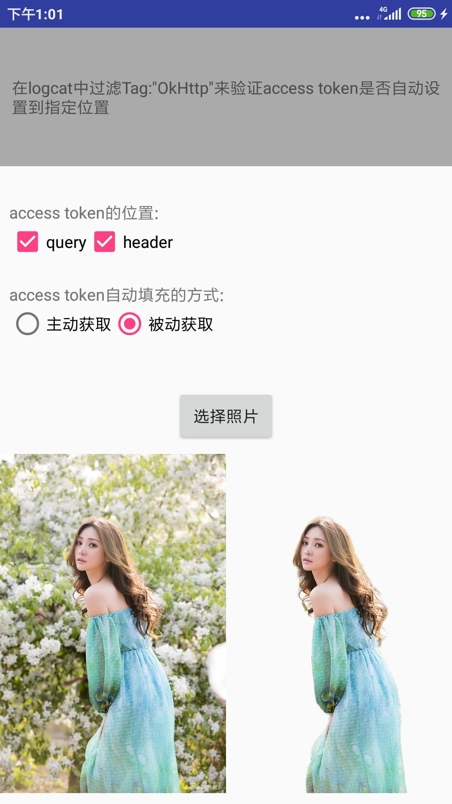

## SmartToken
SmartToken通过使用okhttp的拦截器，自动**获取access _token**，并填充到请求的指定位置。获取、填充过程对使用者无感知。


**有两种方式：**

1. 主动填充
	
	> 判断token是否过期，如果过期，更新主求中的token
2. 被动填充
	
	> 先执行业务请示，如果返回报文是token过期，那么更新token并重新执行业务请求。


## 使用

1. 添加依赖

    ```
    allprojects {
        repositories {
            maven { url 'https://github.com/dwvip/repo/raw/master' }
        }
    }

    implementation 'wang.unclecat.smarttoken:SmartToken:1.1'
    ```

1. 主动填充继承`ActiveSmartToken`，被动填充继承`PassiveSmartToken`，并实现相应的抽像方法(指定token的位置、token对应的key、获取token的具体实现)。将之加入okhttp拦截器。

    **支持的token类型**

    ```java
    int TOKEN_IN_QUERY = 1;//token 在query
    int TOKEN_IN_HEADER = 2;//token 在header
    int TOKEN_IN_QUERY_AND_HEADER = 3;//token 在query和header同时存在
    //本库不支持把access_token放在body中，因为太另类。
    ```

1. 更详细的使用方式，请参考demo中`BaiduAccessToken1.java`和`BaiduAccessToken2.java`
    
    

## demo截图：

 


```